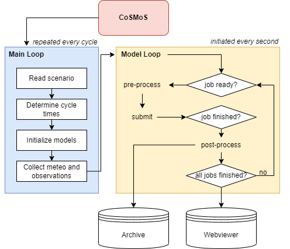
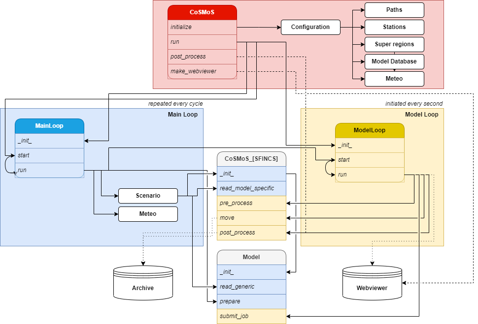

Overview model components and folder structure
------------

**CoSMoS** (Coastal Storm Modelling System) is a Python-based model workflow engine for forecasting and hindcasting coastal hazards (storm surge, waves, coastal (compound) flooding and erosion). 
The CoSMoS system automatically nests models, downloads the necessary meteorological and observational data, post-processes model results and uploads them to a webviewer. 

Figure 1 shows a conceptual overview of the CoSMoS system. In principle, CoSMoS runs continuously through two different loops; a Main Loop (blue box in Figure 1 and 2), which is initated every
forecast cycle (or once when running in hindcast mode) by the main CoSMoS class (red box in Figure 1 and 2), and a Model Loop (yellow box in Figure 1 and 2) that runs through all the model domains until they are completed. 
Once all models have finished, CoSMoS results are uploaded to a webviewer.

  Figure 1: CoSMoS workflow

Figure 2 provides a detailed technical overview of the same CoSMoS workflow. 
The diagram serves as resource for CoSMoS users and developers, providing insight into the specific functions executed in each script. 
It illustrates the interaction and execution sequence of the various CoSMoS Python classes (darker headings) and their sub-functions (italic).
The main model components displayed in Figure 1 and 2 are elaborated in the following sections.

  Figure 2: CoSMoS workflow

Main CoSMoS components
^^^^^^^^^^^^

The CoSMoS system consists of three main Python classes:

**CoSMoS class**

CoSMoS is initialized with the *run_cosmos* (see :ref:`Running CoSMoS <running>`) script, calling the main CoSMoS class (red box in Figure 1 and 2, :py:class:`cosmos.cosmos.CoSMoS`). 

Upon initialization (:py:class:`cosmos.cosmos.CoSMoS.initialize`) of the CoSMoS class, CoSMoS calls the Configuration class (:py:class:`cosmos.cosmos.Configuration`).
The Configuration class reads the main :ref:`configuration file <configuration>` and input settings, sets the model paths, and finds available models in the model database.
In addition, it reads all :ref:`available stations <stations>`, :ref:`meteo datasets <meteo>`, and :ref:`super region files <super_regions>`. 
The CoSMoS class saves all input settings to *self.config*, which can be accessed by other CoSMoS classes. 

The CoSMoS class has three main execution options:

1. run (:py:func:`cosmos.cosmos.CoSMoS.run`): The CoSMoS class starts the :py:class:`cosmos.cosmos_main_loop.MainLoop`.
2. post-process (:py:func:`cosmos.cosmos.CoSMoS.post_process`): The CoSMoS class only starts post-processing (a selection of) finished models within the Model Loop.
3. make webviewer (:py:func:`cosmos.cosmos.CoSMoS.make_webviewer`): The CoSMoS class only makes the webviewer based on finished and post-processed models.

**Main Loop**

In the main loop (blue box in Figure 1 and 2, :py:class:`cosmos.cosmos_main_loop.MainLoop`), the scenario file is read, models are initialized, cycle times are determined, 
meteo and observations are downloaded and collected, and the cosmos model loop (:py:class:`cosmos.cosmos_model_loop.ModelLoop`) is initiated with a scheduler. 
This scheduler starts the cosmos model loop based on the user-defined cycle time interval (forecast mode), 
or just once if ran in hindcast mode. 

**Model Loop**

In the model loop (yellow box in Figure 1 and 2, :py:class:`cosmos.cosmos_model_loop.ModelLoop`), all models are pre-processed, submitted, and post-processed. The model loop initiates itself every second, executing the following tasks:

- Step 1: Checking for finished simulations. If there are finished simulations, they are moved to the scenario :ref:`output folder <output>`, by a model-specific class (see :ref:`Model components<modelclasses>`).
- Step 2: Making a waiting list of models to be executed. The first model on the list is preprocessed and submitted by the (:py:class:`cosmos.cosmos_model.Model`) class and model-specific classes.
- Step 3: The finished model (from Step 1) is post-processed by model-specific classes. 
- Step 4: Checking if all models are finished. If all models are finished, the webviewer is initialized.

.. _modelclasses:
CoSMoS model components
^^^^^^^^^^^^
The three main classes described above use generic and specific model classes to determine how to pre- and post-process the individual models. 
The (:py:class:`cosmos.cosmos_model.Model`) reads generic input data from the :ref:`model.toml files <models>`, prepares model paths and submits jobs. 

The following classes read, write, and move model-specific data:

-   :py:class:`cosmos.cosmos_beware.CoSMoS_BEWARE`
-   :py:class:`cosmos.cosmos_delft3dfm.CoSMoS_Delft3DFM`
-   :py:class:`cosmos.cosmos_hurrywave.CoSMoS_HurryWave`
-   :py:class:`cosmos.cosmos_sfincs.CoSMoS_SFINCS`
-   :py:class:`cosmos.cosmos_xbeach.CoSMoS_XBeach`

These model-specific classes execute the following tasks:

- Read the model input file.
- Extract wave and/or water level conditions from the model it is nested in, and write the forcing file for the current model.
- Write the model input file and meteo forcing.
- Add observation points for nested models and :ref:`observation stations <stations>`.
- Move the files from the job folder (where the model runs) to the scenario folder (see :ref:`Folder structure <folder_structure>`).
- Post-process model results: make (probabilistic) flood / wave map tiles and write (probabilistic) timeseries to csv files.

Additional CoSMoS classes
^^^^^^^^^^^^
The following additional classes are used during the CoSMoS cycle:

.. list-table::
   :widths: 30 70
   :header-rows: 0

   * - :py:class:`cosmos.cosmos_scenario.Scenario`
     - Reads the scenario xml file and initializes the models.

   * - :py:class:`cosmos.cosmos_webviewer.WebViewer`
     - Generates the webviewer

   * - :py:class:`cosmos.cosmos_stations.Stations`
     - Reads the observation stations.

   * - :py:class:`cosmos.cosmos_configuration.Configuration`
     - Initializes CoSMoS configuration.

.. _folder_structure:

CoSMoS folder structure
^^^^^^^^^^^^
The CoSMoS run folder is organized as follows:

.. include:: examples/cosmos_folder.txt
       :literal: 

- *configuration/config.toml* contains the paths to the model executables, model database and meteo folder.
- *configuration/stations* contains the station xml files with observation station locations (see :ref:`Observation stations <stations>`).
- *configuration/super_regions* contains super region files in which models can be grouped (see :ref:`Super regions <super_regions>`).
- *configuration/webviewer_templates* contains webviewer templates that can be used for viewing CoSMoS model outputs (see :ref:`Webviewer <webviewer>`).
- *jobs* is the folder in which the models are running.
- *meteo/meteo_subsets.xml* contains the meteo sources (see :ref:`Meteo <meteo>`). 
- *scenarios* contains the model scenario folders with scenario input files and model results (see :ref:`Scenario <scenario>`).
- *model_database* contains the individual model input files and model description (see :ref:`Models <models>`).
- *run_cosmos.py* contains an example of how to run CoSMoS (see :ref:`Running CoSMoS <running>`).

.. .. The following table provides an overview of all cosmos system components:

.. .. list-table::
..    :widths: 30 70
..    :header-rows: 0

..    * - :py:class:`cosmos.cosmos_main.CoSMoS`
..      - When CoSMoS is initialized with the () script, input settings are passed to the CoSMoS class (:py:class:`cosmos.cosmos_main.CoSMoS`). 
..         This class saves input settings to self.config, which can be accessed by other CoSMoS classes. 
..         The CoSMoS class then starts the :py:class:`cosmos.cosmos_main_loop.MainLoop`.

..    * - :py:attr:`cosmos.cosmos_mainloop.MainLoop`
..      - In the main loop, the xml scenario is read, cycle times are determined and the cosmos model loop is initiated.