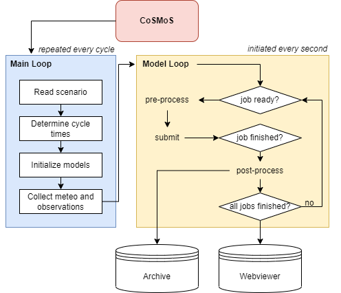
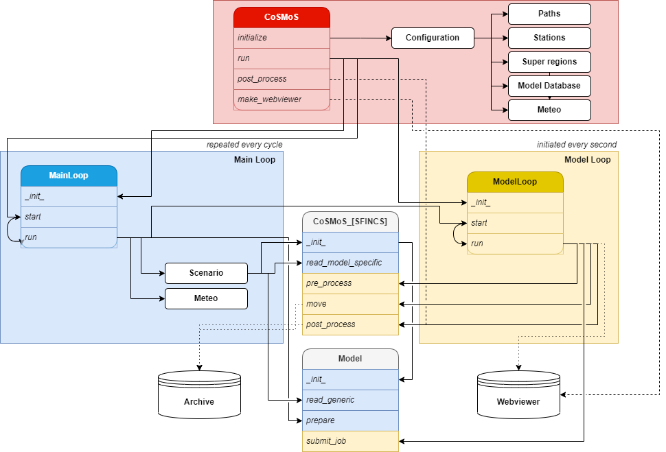

.. _workflow:

How CoSMoS works
----------------

This section describes what happens internally when CoSMoS runs a forecast
cycle.

Overview
^^^^^^^^

CoSMoS operates through two nested loops (Figure 1):

1. A **Main Loop** (blue) that runs once per forecast cycle — or once in hindcast
   mode.
2. A **Model Loop** (yellow) that iterates until all models have finished.

   Figure 1: Simplified CoSMoS workflow.

Figure 2 provides a detailed technical view of the same workflow, showing the
specific Python classes and functions involved.

   Figure 2: Detailed CoSMoS workflow.

Initialization
^^^^^^^^^^^^^^

When you call ``cosmos.initialize(main_path)``, CoSMoS reads the
:ref:`configuration file <configuration>` and sets up all paths, executables,
observation stations, meteorological datasets, and super region definitions.
The configuration is stored in ``cosmos.config`` and is accessible throughout
the system.

Main Loop
^^^^^^^^^

When ``cosmos.run(scenario_name)`` is called, the Main Loop starts and performs
the following steps:

1. **Read scenario** — parse the :ref:`scenario TOML file <scenario>` and
   initialize all models with their nesting relationships.
2. **Determine cycle times** — calculate start and stop times for the current
   forecast cycle.
3. **Download meteorological data** — fetch wind, pressure, and precipitation
   fields from configured data sources (see :ref:`Meteo <meteo>`).
4. **Collect meteorological data** — read downloaded data into memory and, for
   tropical cyclone events, extract the storm track.
5. **Generate track ensemble** — if running in ensemble mode, generate synthetic
   cyclone tracks and identify which models fall within the ensemble cone.
6. **Start Model Loop** — hand control to the Model Loop to execute all models.
7. **Build web viewer** — once all models have finished, generate the
   :ref:`web viewer <webviewer>`.
8. **Clean up** — remove old files from previous cycles.

In continuous forecast mode, the Main Loop repeats at the configured cycle
interval (e.g. every 6 hours).

Model Loop
^^^^^^^^^^

The Model Loop runs continuously (checking every second) and manages the
lifecycle of each model:

- **Check for finished simulations** — detect models that have completed and
  move their output to the scenario folder.
- **Build waiting list** — determine which models are ready to run (i.e. their
  parent models have finished).
- **Pre-process** — for the next model on the waiting list:

  - Set simulation times and output intervals.
  - Write meteorological forcing files.
  - Add observation points for nested models and stations.
  - Set up boundary conditions (nesting step 1).
  - Copy the job runner script to the job folder.

- **Submit** — launch the model simulation (locally, on a parallel worker, or
  in the cloud).
- **Post-process** — for finished models:

  - Extract time series at observation stations.
  - Generate map tiles (flood maps, wave heights, water levels).
  - Nest boundary conditions into child models (nesting step 2).

- **Check completion** — when all models have finished, signal the Main Loop to
  build the web viewer.

Model nesting
^^^^^^^^^^^^^

CoSMoS uses a two-step nesting procedure:

- **Nesting step 1** (before simulation): observation points are added to the
  parent model at the boundary point locations of the child model, so that the
  parent writes output at those positions.
- **Nesting step 2** (after parent simulation): time series are extracted from
  the parent model output and written as boundary conditions for the child
  model.

This is handled automatically based on the ``flow_nested`` and ``wave_nested``
keywords in the :ref:`model TOML files <models>`.

Execution modes
^^^^^^^^^^^^^^^

CoSMoS supports three execution modes, configured via ``run_mode`` in the
:ref:`configuration file <configuration>`:

- **serial** — all models run sequentially on the local machine.
- **parallel** — models are distributed across multiple machines that share the
  same run folder. Worker machines run ``run_parallel.py`` to pick up jobs.
- **cloud** — models are submitted as Argo Workflow jobs on a Kubernetes cluster,
  with input/output transferred via AWS S3.
